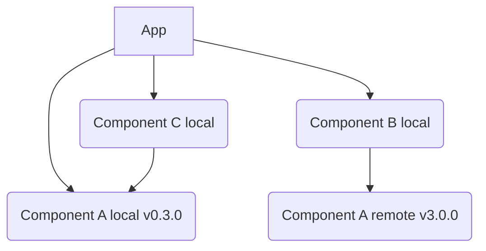

# Purpose

- This repo demonstrates how to use versioned components with yarn workspaces in a monorepo.
- Specifically this repo uses two different versions of `component-a`, a local version (0.3.0) checked in and a remote version (3.0.0) via npm.

## Dependency Tree Illustrated by code

- The main app and 3 components (A, B, & C) exist.  All 3 components A-C are local yarn workspaces, but component A also has some versions published to npm.  App & C directly reference the local version of A while B references the remotely published version of A. 
 


In this way when running the app multiple versions of A can coexist at runtime, for example here is the program output.

```
I can pull in the package component-a directly Component-A 0.3.0 (local)
I can pull in the package component-b with transient remote component-a Component-B 0.1.0 (local) referencing Component-A 3.0.0
I can pull in the package component-c with transient local component-a Component-C 0.1.0 (local) referencing Component-A 0.3.0 (local)
```

### Local
- @dfs-demo/component-a v 0.3.0 is available locally

### Remote (npm)
@dfs-demo/component-a has the following versions that can be tested https://www.npmjs.com/package/@dfs-demo/component-a
  - 3.0.0
  - 2.5.5
  - 2.5.0
  - 2.0.0

# Setup

1. Clone project
2. Run `yarn install`

## Validate Local
1. Run `yarn start`
2. Update to a remote, run `yarn workspace app add @dfs-demo/component-a@2.0.0`
    1. Run `yarn workspace app start` again and see if output is different

## Notes
- Installing with a wildcard `*` will prefer local, i.e. `yarn workspace app add @dfs-demo/component-a@*`
- Installing using a specific local version will use workspaces, specific remote version will use npm, and mismatch will error as expected.
- Running `yarn workspace @dfs-demo/component-b add @dfs-demo/component-a` adds the latest npm version of component-a, not the local